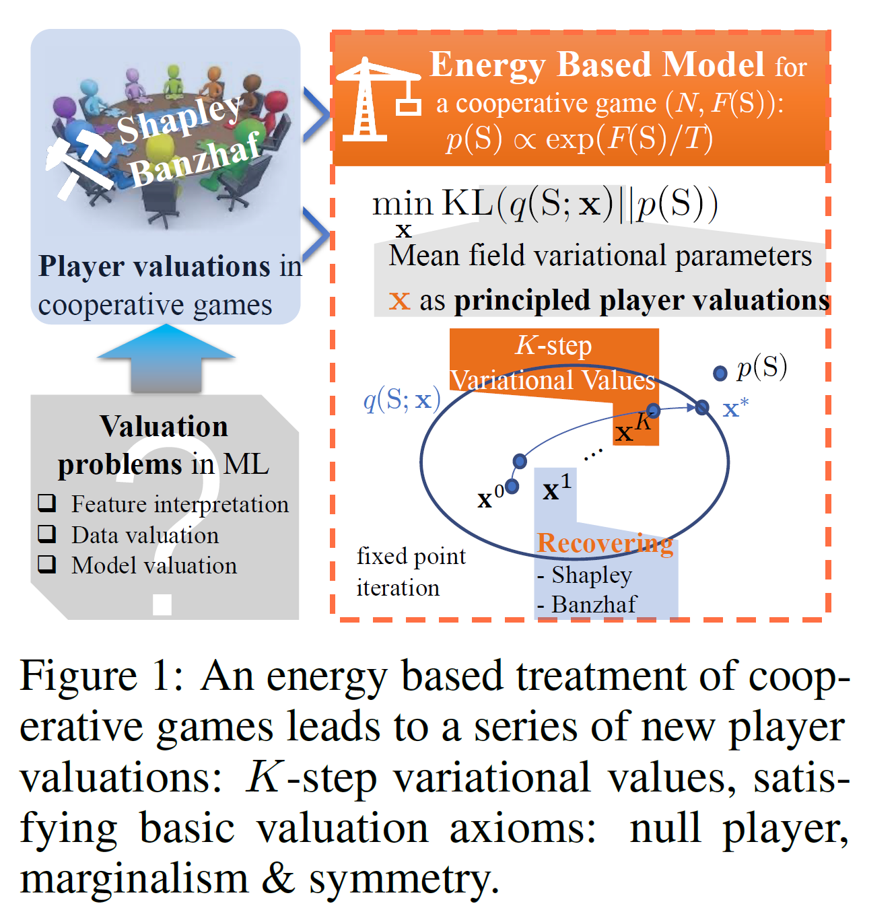

## Energy-Based Learning for Cooperative Games, with Applications to Valuation Problems in Machine Learning

  Yatao Bian1, Yu Rong1, Tingyang Xu1,  Jiaxiang Wu1, Andreas Krause2, Junzhou Huang1  
1Tencent AI Lab  
2ETH Zurich  

### Project Description

Valuation problems, such as  feature interpretation, data valuation and model valuation for ensembles, become increasingly more important in many machine learning applications.  Such problems are commonly addressed via  well-known game-theoretic criteria,  such as the Shapley value or Banzhaf value.

In this work, we present a novel energy-based treatment for cooperative games, with a theoretical justification by the maximum entropy principle.  Surprisingly, by conducting mean-field variational inference of the energy-based model, we recover classical game-theoretic valuation criteria
through conducting _one-step_ fixed point iteration for maximizing the ELBO objective.  This observation also verifies the rationality of existing criteria, as they are all attempting to decouple the correlations among  players. By running the fixed point iteration for multiple steps, we achieve a trajectory of the variational  valuations,  among which we define the valuation with the best conceivable decoupling error as the Variational Index.  We prove that under uniform initializations,  these variational valuations all satisfy a set of game-theoretic  axioms. We empirically demonstrate that the proposed Variational Index  enjoys lower decoupling error and better valuation performance  on certain synthetic and real-world valuation problems.

### Paper

ICLR 2022:  <https://openreview.net/forum?id=xLfAgCroImw>

### Video, Poster and Slides

- Video:   <https://iclr.cc/virtual/2022/poster/6807>

- Poster:  <https://yataobian.com/docs/val-game-poster-v2.png>

- Slides:  <https://yataobian.com/docs/valuation-game-slides-v3.pdf>

### Code and Document

To be released.

### Contact

Yatao Bian (https://yataobian.com)
